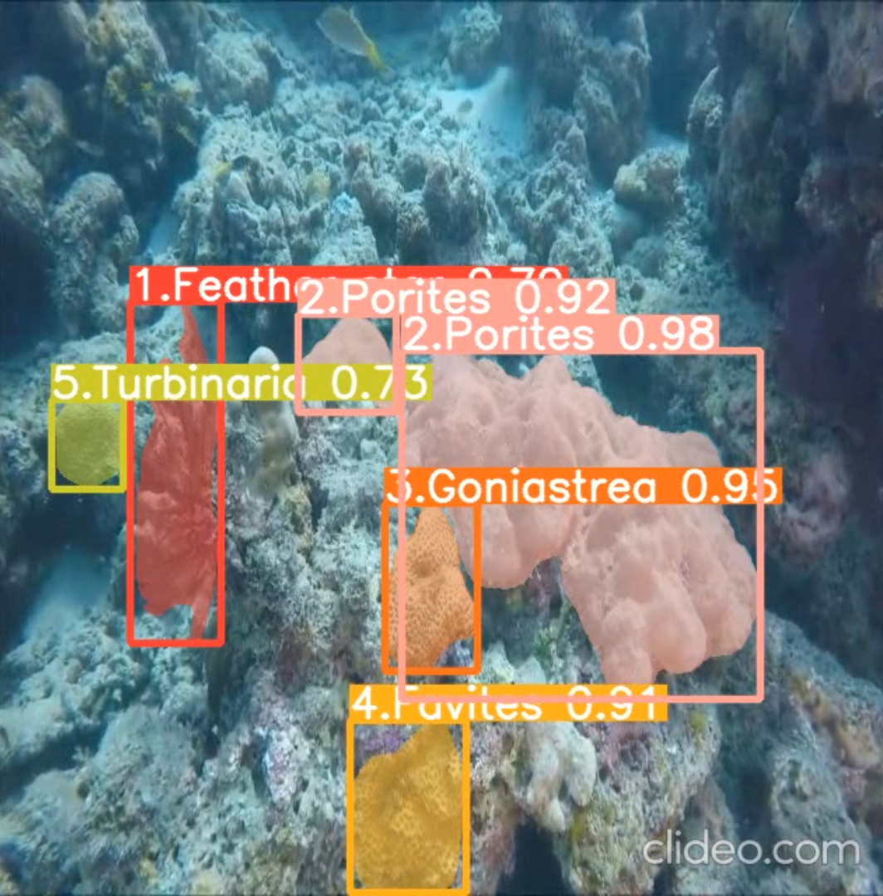

# Fine-Grained Coral Instance Segmentation using YOLOv8

This repository implements a high-precision instance segmentation system designed for the automated monitoring of coral reef ecosystems in Indonesia. Situated within the **Coral Triangle**, Indonesia's reefs are "marine rainforests" that support critical biodiversity but face significant threats from climate change and human activity.

## Prediction Results
Below is a comparison of the segmentation results showing the **Ground Truth**, the model without preprocessing (**YOLOv8m-Wp**), and our optimized model (**YOLOv8m-Pp**). 

<div align="center">
  
  <p><i>Figure: Comparison of Ground Truth and YOLOv8m-Pp segmentation results.</i></p>
</div>

*The YOLOv8m-Pp model demonstrates superior object boundary delineation, especially in complex reef structures.*

## Dataset & Preparation

The dataset used in this research is specifically curated for the challenges of underwater computer vision in Indonesian coral reef environments.

### Data Composition
* **Core Set**: Consists of 755 high-quality coral reef images captured using a Remotely Operated Vehicle (ROV).
* **Secondary Set**: Comprises 1,359 images generated through strategic data augmentation of the core set to improve model robustness.
* **Annotations**: Each image features pixel-level masks for six species: *Favites, Feather-star, Goniastrea, Gorgonian, Porites,* and *Turbinaria*.

### Preprocessing Pipeline
To overcome underwater optical challenges like light scattering and color distortion, a specialized pipeline was implemented:
* **Standardization**: All images were auto-oriented and resized to **640x640 pixels** to match YOLOv8 input requirements.
* **Luminance Optimization**: Applied **Histogram Equalization (HE)**, which was empirically proven in this study to be the most effective technique for enhancing low-contrast regions.
* **Data Splitting**: The dataset was partitioned into **Training (80%)**, **Validation (15%)**, and **Testing (5%)** sets to ensure rigorous evaluation.

### Source
The base dataset is publicly available on Roboflow:
[Coral Segmentation Dataset](https://universe.roboflow.com/nuthan-varma-b5j2d/segmentation_corals)

## Key Technical Breakthroughs
* **Top Performance**: The **YOLOv8m-Pp** (Medium with Preprocessing) model achieved a precision of **96.7%**, a recall of **95.9%**, and a mean Average Precision ($mAP_{50}$) of **98.2%**.
* **Optimal Preprocessing**: Our research identified **Histogram Equalization (HE)** as the most effective technique for underwater environments, successfully balancing high accuracy with a training efficiency of **31.62 minutes**.
* **Architectural Edge**: By utilizing YOLOv8's anchorless detection and CSPNet/PANet innovations, the system provides superior boundary delineation for complex reef structures.

## Segmented Coral Species
The model is optimized to identify and segment six distinct coral and marine categories:
1.  **Favites**
2.  **Feather-star**
3.  **Goniastrea**
4.  **Gorgonian**
5.  **Porites**
6.  **Turbinaria**

## Comparative Analysis
Our study compared several YOLO architectures to determine the optimal balance between accuracy and resource demands:

| Model | Precision | Recall | $mAP_{50}$ | Params (M) | Training Time (Min) |
| :--- | :--- | :--- | :--- | :--- | :--- |
| **YOLOv8m-Pp** | **0.967** | **0.954** | **0.982** | **27.2** | **31.62** |
| YOLOv7-seg | 0.952 | 0.958 | 0.973 | 37.8 | 22.20 |
| YOLOv5-seg | 0.937 | 0.956 | 0.961 | 7.6 | 14.46 |
| YOLOv8m-Wp | 0.953 | 0.840 | 0.884 | 27.2 | 19.74 |


## Usage & Inference
To run instance segmentation on underwater video data (e.g., `coraltest.mp4`), the following inference logic is utilized:

```python
from ultralytics import YOLO

# Load the best-performing model weights (YOLOv8m-Pp)
model = YOLO('weights/best.pt')

# Perform inference on video with a 0.25 confidence threshold
results = model.predict(
    source='output/coraltest.mp4', 
    conf=0.25, 
    save=True,
    imgsz=640
)

```

## Citation

If you use this work or the YOLOv8m-Pp weights in your research, please cite the original paper:

**APA Style:**
Hassanudin, W. M., Utomo, V. G., & Apriyanto, R. (2024). Fine-Grained Analysis of Coral Instance Segmentation using YOLOv8 Models. *Sinkron: Jurnal dan Penelitian Teknik Informatika*, 8(2), 1047-1055. https://doi.org/10.33395/sinkron.v8i2.13583

**BibTeX:**
@article{hassanudin2024fine,
  title={Fine-Grained Analysis of Coral Instance Segmentation using YOLOv8 Models},
  author={Hassanudin, Wahyu Maulana and Utomo, Victor Gayuh and Apriyanto, Riski},
  journal={Sinkron: Jurnal dan Penelitian Teknik Informatika},
  volume={8},
  number={2},
  pages={1047--1055},
  year={2024},
  doi={10.33395/sinkron.v8i2.13583}
}
